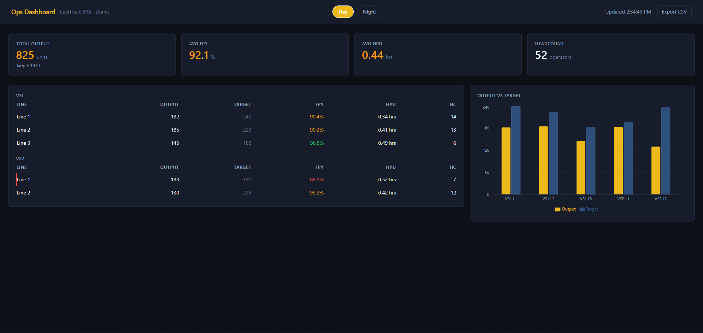
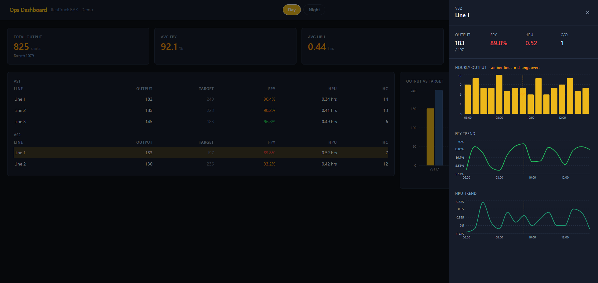

# Ops Dashboard — RealTruck BAK

> Real-time production monitoring for manufacturing floor operations. Built for shift supervisors who need to catch at-risk lines before they miss targets — not after.

BAK Industries runs multiple production lines across two value streams. Historically, shift performance was tracked in spreadsheets and reviewed after the fact. This dashboard replaces that workflow with live KPI visibility, automatic at-risk flagging, and one-click shift reporting — built to the same standards you'd ship to production.

**[Live demo →](https://ops-dashboard-demo.vercel.app)**

---

## Features

- **Automatic at-risk detection** — Lines where first-pass yield falls below 90% *and* output lags behind target are flagged with a red border in real time. Supervisors see the problem; they don't have to calculate it.
- **Per-line drill-down** — Clicking any row opens a slide-out panel with hourly output, FPY trend, and HPU trend charts for that specific line, including markers for every changeover. Full shift context without leaving the page.
- **Day / Night shift toggle** — Each shift carries independent targets and trend data. Switching between them reloads all KPIs and charts instantly.
- **One-click CSV export** — Downloads a timestamped, properly quoted snapshot of the current shift's line-by-line performance — ready to open in Excel or Google Sheets, no formatting required.
- **Production-grade UX** — Layout-matched loading skeletons on first fetch, graceful error states with retry, smooth opacity transitions on background poll, keyboard-accessible drawer with Escape and outside-click dismissal.

---

## Screenshots




---

## Tech Stack

| Layer      | Technology              |
|------------|-------------------------|
| Framework  | Next.js 16 (App Router) |
| UI         | React 19                |
| Styling    | Tailwind CSS 4          |
| Charts     | Recharts 3              |
| Language   | TypeScript 5            |
| Deploy     | Vercel                  |

---

## Getting Started

**Prerequisites:** Node.js 18+ and npm.

```bash
# Clone
git clone https://github.com/southwestmogrown/ops-dashboard-demo.git
cd ops-dashboard-demo

# Install
npm install

# Configure (see Environment Variables below)
cp .env.example .env.local

# Run
npm run dev
```

Open [http://localhost:3000](http://localhost:3000). The dashboard polls `/api/metrics` every 30 seconds and responds immediately to shift changes.

---

## Environment Variables

| Variable    | Required | Description                                                                                                         |
|-------------|----------|---------------------------------------------------------------------------------------------------------------------|
| `DEMO_SEED` | No       | Integer seed that locks the RNG to a specific dataset across refreshes. Omit to use shift defaults (`day=1001`, `night=3003`). Set `18606` in Vercel for a dataset that exercises every status colour and alert state in the UI. |

To set in Vercel: **Project → Settings → Environment Variables → Add** `DEMO_SEED` = `18606`, environment: Production.

---

## Architecture

The dashboard is a single Next.js page that owns all state. Data flows from a `/api/metrics` route — backed by a seedable Mulberry32 RNG — through React state, down to four components: `LineTable`, `OutputChart`, `LineDrawer`, and `KpiCard`. The mock data layer is a clean, swappable interface: replacing it with a live MES WebSocket adapter requires no changes to the component layer.

`LineDrawer` is deliberately isolated from the main layout and earmarked for promotion to a `/line/[id]` route in a future release, enabling shareable deep-links and per-line access control without a component rewrite.

---

## Roadmap

- [ ] **Per-line routes** (`/line/[id]`) — shareable deep-links to individual line views with per-line access control for value-stream leads
- [ ] **Changeover timestamp tracking** — captures start/end times per changeover to enable MTCO reporting and scheduling system integration
- [ ] **Live data adapter** — WebSocket connection to plant MES replaces the mock layer; component API unchanged
- [ ] **Role-based views** — supervisor, operator, and plant-manager permission tiers gating export, drill-down, and cross-value-stream visibility
